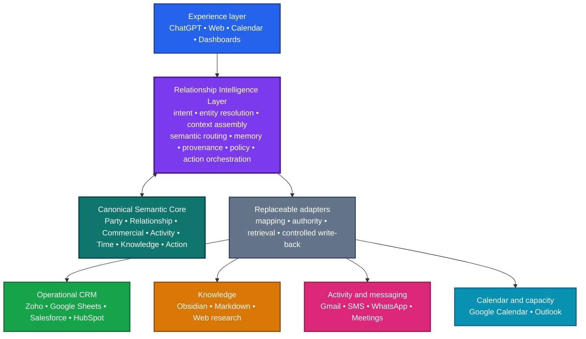

# NeoCRM

> **NeoCRM owns the semantic model, not the storage model.**
>
> **Persistence is replaceable. Intelligence is not.**
>
> **Calendar = View; Time = Domain.**
>
> **NeoCRM doesn't own the world's data. It creates a coherent model of the relationships represented by that data.**

**Status:** v0.1 — experimental semantic architecture.

NeoCRM is an AI-first relationship-intelligence system. It makes relationship data, activity, knowledge, commitments, commercial context, and time useful together—without making any vendor's schema or interface the product's model.

## Architecture at a glance

The teal Semantic Core and purple Relationship Intelligence Layer are NeoCRM itself. The surrounding systems are replaceable implementation substrates.

## What v0.1 establishes

- a canonical semantic model for Party, Relationship, Commercial, Activity, Time, Knowledge, and Action;
- the Relationship Intelligence Layer: intent, entity resolution, context assembly, semantic routing, memory, provenance, policy, reasoning, and action orchestration;
- adapters that map systems such as Zoho, Google Sheets, Obsidian, Gmail, SMS/WhatsApp, Google Calendar, and Outlook to the canonical model;
- explicit distinctions between type, role, and relationship—especially Customer as a role available to Person, Company, or Household;
- first-class time, commitments, availability, capacity, workload, and time series; and
- a requirement → ADR → experiment → evidence → revised-design loop.

It does **not** yet claim a final database, public API, production UI, complete security implementation, or autonomous agent. The current API and PostgreSQL material are exploratory implementation probes, not the definition of NeoCRM.

## Start here

1. [Thesis](vision/thesis.md) and [design principles](vision/principles.md).
2. [Canonical semantic model](requirements/semantic-model.md).
3. [Architecture overview](architecture/overview.md) and [colour Mermaid source](architecture/diagrams/layered-architecture.mmd).
4. [Domain concepts](domain/) and [architecture decisions](adr/).
5. [Experiments](experiments/README.md), which turn architecture claims into evidence.

## Repository map

| Directory | Purpose |
| --- | --- |
| [vision/](vision/) | Origin, thesis, principles, and vocabulary |
| [requirements/](requirements/) | Behavioural, quality, and semantic requirements |
| [architecture/](architecture/) | Layered architecture, adapters, provenance/policy, and time |
| [domain/](domain/) | Canonical domain concepts |
| [adr/](adr/) | Architectural Decision Records |
| [experiments/](experiments/) | Testable hypotheses and evidence |
| [research/](research/) | Research curation |
| [apps/](apps/) and [db/](db/) | Non-authoritative implementation probes |
