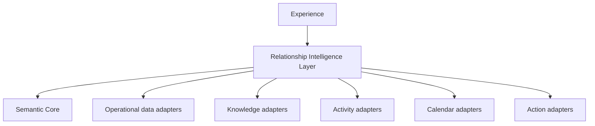

# Architecture Overview

## Layers

1. **Experience** — conversational, calendar, dashboard, or web interfaces.
2. **Relationship Intelligence** — intent recognition, entity resolution, context planning, semantic routing, policy, provenance, reasoning, memory, and action orchestration.
3. **Semantic Core** — canonical concepts and relationships.
4. **Adapters** — systems that provide operational data, knowledge, activity, calendar data, and action endpoints.



## Context assembly loop

```text
User intent
  → entity resolution
  → context plan
  → governed adapter retrieval
  → normalization and reconciliation
  → provenance-aware reasoning
  → answer or proposed action
  → human approval (when required)
  → adapter execution and audit
```

The Intelligence Layer does not directly expose native sources as the user model. It plans which evidence is needed, then presents a clear answer that retains its evidence boundary.
