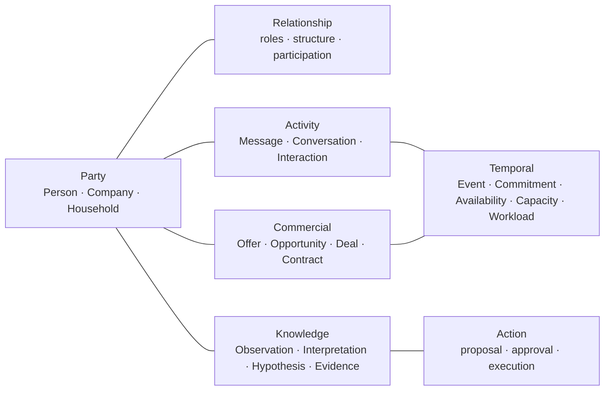

# Canonical Semantic Model

NeoCRM's canonical model is a vocabulary for reasoning, not a prescribed database schema. Every adapter must map its native records into this model without forcing all sources to share one physical store.

## Domains



## Modelling rules

1. **Party is the root participant abstraction.** A Party may participate in a relationship, activity, opportunity, deal, contract, commitment, or action.
2. **Person, Company, and Household are Party types.** Future types are possible, but must not be introduced merely to encode a role.
3. **Customer is a role, not a Party type.** Any Party may be a Customer. A Party may also hold multiple roles at once.
4. **Relationship has semantics.** Relationship is not a free-text link; it carries type, parties, roles, context, period, provenance, and evidence.
5. **Company structure is relational.** Divisions, subsidiaries, business units, partners, and employment links are relationships involving a Company. A division is not automatically a new Party type.
6. **Offer, Product, and Service are different from commercial pursuit.** Product and Service describe what is sold; Opportunity describes potential; Deal describes a specific commercial transaction; Contract describes the formal agreement.
7. **Activity is distinct from its source channel.** Raw messages stay in their systems of record while NeoCRM maps their relationship meaning.
8. **Time is not mere metadata.** Events, intervals, commitments, availability, capacity, workload, and time series have independent semantics.
9. **Knowledge assertions retain epistemic state.** Facts, observations, interpretations, hypotheses, and recommendations are not interchangeable.

## Canonical assertion envelope

All materialized facts or derived assertions should be representable with:

```yaml
id: stable-canonical-identifier
kind: fact | observation | interpretation | hypothesis | recommendation
subject: canonical-entity-or-relationship
claim: human-readable-or-structured-assertion
source:
  system: adapter-or-origin
  source_id: native-identifier
  retrieved_at: ISO-8601 timestamp
confidence: high | medium | low
valid_time: optional interval
provenance: source, transformation, and reasoning notes
```
