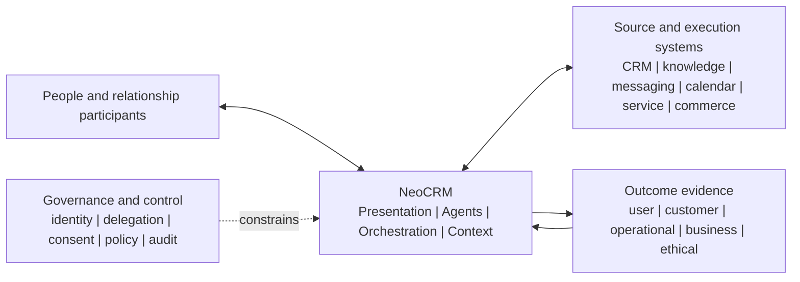

# System context

**Status:** Proposed architecture baseline

NeoCRM sits between relationship participants and the systems that hold or execute operational work. Its boundary is defined by semantics, agency, orchestration, context, policy, and outcomes—not by ownership of every datum.

## Participants

- **Relationship owner and customer-facing specialists** remain accountable for goals and consequential judgment.
- **Coordinator and specialist Agents** plan and perform delegated bounded work.
- **Policy/governance functions** define data, consent, autonomy, approval, retention, fairness, and redress controls.
- **Data/system stewards** define mappings, authority, quality, and source boundaries.
- **Customers and other Parties** are relationship participants whose value, rights, and outcomes remain explicit.
- **Source systems** retain their own operational records and execute authorized effects through bounded interfaces.

## System boundary

NeoCRM owns canonical meaning, Agent and orchestration contracts, context planning, provenance, policy decisions, action lifecycle, and outcome-learning governance. It may materialize approved semantic state, but does not claim universal ownership of source data or source-side transactions.

The current executable boundary is smaller: CAP-001 uses synthetic adapters and performs only deterministic read-only context assembly.
