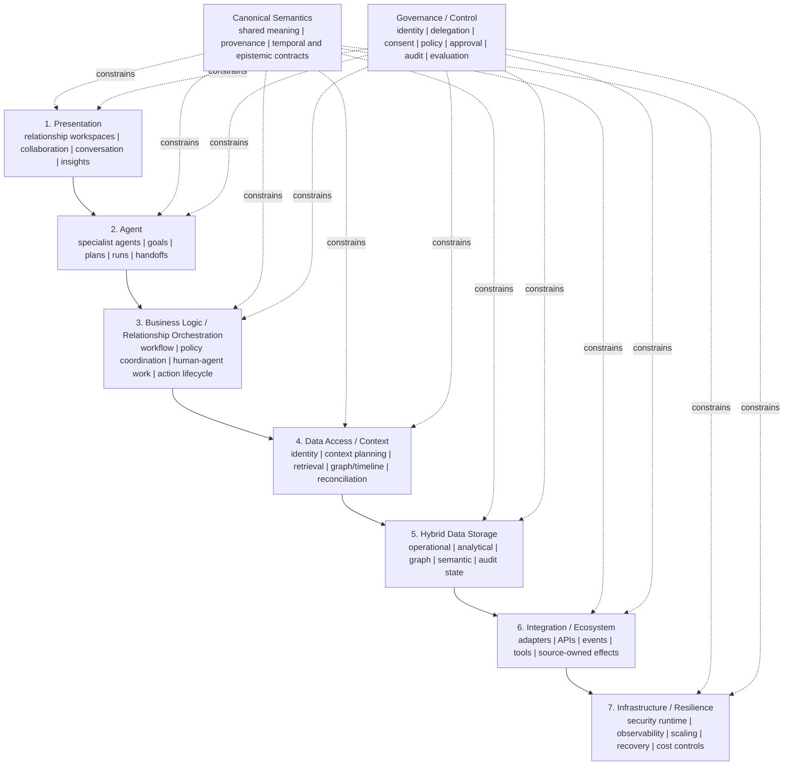
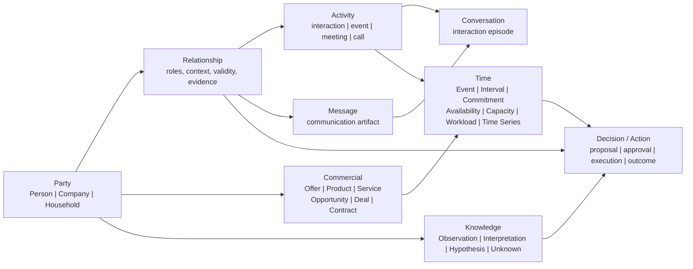
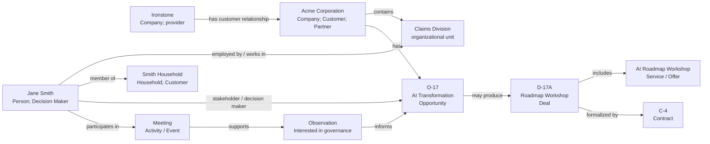

# NeoCRM v0.1: Canonical Agent-Native Relationship Architecture

**Status:** v0.1 -- adopted design baseline; empirical validation pending  
**Purpose:** canonical repository foundation for `Ironstone-Advisory/neocrm`  
**Normative vocabulary:** *must*, *should*, and *may* indicate the intended v0.1 contract.  
**Implementation status:** this document defines what NeoCRM is and how it is to be evaluated. It does not claim that a production CRM has been built.

> **NeoCRM owns the semantic model, not the storage model.**
>
> **Persistence is replaceable. Intelligence is not.**
>
> **Calendar = View; Time = Domain.**
>
> **NeoCRM doesn't own the world's data. It creates a coherent model of the relationships represented by that data.**

## Contents

1. [Origin, thesis, and problem](#1-origin-thesis-and-problem)
2. [Principles and the AI-first inversion](#2-principles-and-the-ai-first-inversion)
3. [Layered architecture](#3-layered-architecture)
4. [Canonical semantic model](#4-canonical-semantic-model)
5. [Intelligence, provenance, and governed action](#5-intelligence-provenance-and-governed-action)
6. [Adapters, ownership, and persistence independence](#6-adapters-ownership-and-persistence-independence)
7. [Operational flows and examples](#7-operational-flows-and-examples)
8. [Canonical CRM Test Suite](#8-canonical-crm-test-suite)
9. [Experimental program](#9-experimental-program)
10. [Measurement framework](#10-measurement-framework)
11. [Repository foundation and ADRs](#11-repository-foundation-and-adrs)
12. [Security and governance](#12-security-and-governance)
13. [Scope, roadmap, and open questions](#13-scope-roadmap-and-open-questions)
14. [State-of-the-art research: support and challenge](#14-state-of-the-art-research-support-and-challenge)

---

## 1. Origin, thesis, and problem

### 1.1 Origin

NeoCRM originated in Rob Tyrie's essay asking what CRM would become if AI agents and intelligence were its foundation rather than features attached to database schemas, forms, lists, and departmental modules. The adopted product intent is a human-agent operating model for managing relationships: people collaborate with specialized agents across sales, service, marketing, and cross-functional work; the system senses relevant change, plans under policy, and learns through governed evaluation of outcomes.

The 2026 work turns that proposition into a falsifiable architecture and product experiment. Conversation is an important experience, but it is one projection among relationship workspaces, agent collaboration, insight exploration, graph, timeline, calendar, commercial, service, campaign, approval, evidence, and outcome views. Existing systems such as Zoho, Google Sheets, Obsidian, Gmail, or Google Calendar are replaceable substrates and integration endpoints, not the definition of NeoCRM.

This lineage matters. NeoCRM is not a claim that conventional CRM software is useless, nor a plan to reproduce every feature of Salesforce, Zoho, or HubSpot. It is an attempt to answer a narrower and more consequential question:

> Can people and governed specialist agents understand, manage, and improve unified relationships across systems without forcing those relationships into one vendor's object model or surrendering human accountability?

### 1.2 Thesis

**NeoCRM is an AI-first, agent-native relationship-management system.** It coordinates people and specialized agents around shared relationship goals, using a governed and explainable semantic model across customer context, knowledge, interactions, commitments, commercial work, service, engagement, and time. It is proactive only within explicit policy and delegation, and it improves through evaluated outcomes rather than silent self-modification.

Systems of record remain important: they provide durable operational state, permissions, workflow state, transactional history, and integration reach. NeoCRM relocates the organizing center from vendor screens and schemas to agent collaboration, relationship semantics, governed orchestration, and measured outcomes.

### 1.3 Problem statement

Conventional CRM normally begins with an application-specific record model:

```text
Lead -> Contact -> Account -> Opportunity -> Activity
```

That model is useful but incomplete. A real relationship may span people, households, legal entities, divisions, partners, conversations, meeting notes, commitments, proposals, contracts, availability, external research, uncertainty, and evolving interpretations. Important context is split across CRM records, email, calendars, messaging, documents, spreadsheets, web research, and the user's memory.

The user must therefore navigate many screens and infer the situation manually. A question such as *"What do I need to know before I call Jane?"* is not a request for one record. It requires identity resolution, relationship history, current commercial state, recent activity, relevant knowledge, commitments, timing, and an account of what is known versus inferred.

The resulting failures are familiar:

- the database becomes a compliance task rather than a relationship tool;
- critical knowledge is buried in notes, inboxes, or individuals' memories;
- "customer", "account", "contact", and "opportunity" mean different things in different systems;
- time is reduced to timestamps and due dates instead of capacity, commitments, and attention;
- AI summarizes disconnected records but cannot establish authoritative context or safely act;
- integrations duplicate data without defining ownership or reconciling conflicts; and
- users cannot tell a sourced fact from an observation, hypothesis, or recommendation.

NeoCRM addresses these failures by making agents, goals, plans, collaboration, semantics, epistemic status, provenance, consent, temporal state, policy, action, and outcomes first-class.

### 1.4 Product boundary

NeoCRM v0.1 is a product and architecture specification plus bounded implementation probes. It is not, in v0.1:

- a replacement database or universal customer-data platform;
- a promise of autonomous selling;
- a vendor-specific Zoho, Salesforce, or Obsidian integration product;
- a production agent workforce, complete ontology, public API, or finished user interface;
- an assertion that all relationship information should be centralized.

It is a hypothesis made concrete enough to test.

---

## 2. Principles and the AI-first inversion

### 2.1 Design principles

1. **Agents and intelligence are foundational.** Start with relationship goals, participants, decisions, and outcomes; derive workflows, context, and storage requirements from them.
2. **Semantic ownership is independent of persistence.** NeoCRM defines the meaning of Party, Relationship, Commitment, and other canonical concepts. An adapter maps that meaning to an external system.
3. **Types, roles, and relationships are distinct.** Types describe what an entity is; roles describe what it means in a business context; relationships describe how entities are connected.
4. **Relationships are primary.** A contact record is insufficient. The system models the connection between entities, its context, time, evidence, strength, and commercial implications.
5. **Activity is a stream, not a note field.** Calls, meetings, tasks, and other work are canonical Activities. Messages are distinct communication artifacts that can evidence or accompany Activities, and channels are implementations.
6. **Time is a domain, not metadata.** Events, intervals, commitments, availability, capacity, workload, and time series are first-class and can be rendered in a calendar.
7. **Knowledge is not fact by default.** Observations, interpretations, hypotheses, unknowns, and recommendations must retain their epistemic state and evidence.
8. **Human-agent collaboration is explicit.** Agents act only through declared purpose, capability, delegation, policy, and accountability; consequential work reaches the right human boundary.
9. **Provenance is part of the answer.** A useful answer carries source, authority, freshness, transformation history, confidence, and completeness as independent dimensions.
10. **Portability is a design test.** The same semantic query should remain meaningful when a CRM, knowledge repository, or calendar implementation is substituted.
11. **Experiences organize relationship work, not records.** Conversation, workspaces, queues, graph, timeline, calendar, and insight views are projections over shared semantics.
12. **Proactivity is policy-bound.** Events, schedules, and outcome gaps may trigger sensing and planning, but not opaque or unsolicited customer effects.
13. **Learning is governed.** Outcomes create learning signals and change proposals; they do not silently rewrite facts, policy, prompts, models, or authority.
14. **Experiments decide claims.** Assumptions are recorded as requirements, ADRs, and hypotheses, then tested on realistic work rather than defended as doctrine.

### 2.2 AI-first versus database-first CRM

| Dimension | Database-first CRM | NeoCRM AI-first architecture |
| --- | --- | --- |
| Starting point | Vendor records, schemas, fields, screens | Human intent, relationship context, and semantic objects |
| Primary user work | Navigate, search, update, interpret | Collaborate with agents toward relationship goals and outcomes |
| Intelligence | Feature attached to an application | Specialized agents plus shared relationship intelligence across systems |
| Data model | Application-specific entities | Canonical semantic model mapped by adapters |
| Knowledge | Notes and attachments subordinate to records | First-class, linked, epistemically typed knowledge |
| Activity | Logged metadata | A temporal interaction stream and conversation history |
| Calendar | Separate application or activity view | A rendering of the Time domain |
| Integration | Data synchronization and point-to-point fields | Semantic retrieval, ownership rules, and controlled write-back |
| AI action | Vendor feature or opaque automation | Delegated, policy-governed work with preview, approval, verification, and audit |
| Portability | Migration between product schemas | Substitution of persistence while preserving semantics |

The inversion is:

```text
Database-first:  data -> screens/forms -> human interpretation -> action
AI-first:        trigger -> shared goal -> agent plan -> governed context/action -> outcome -> evaluated learning
```

NeoCRM does not eliminate data stores. It assigns them a clean role: **systems of record are infrastructure for a semantic, intelligent relationship experience.**

---

## 3. Layered architecture

### 3.1 Overview

NeoCRM has seven logical layers. They define responsibilities, not deployment units or mandatory products. Two cross-cutting planes govern every layer. The **Relationship Intelligence Layer (RIL)** is the product-defining intelligence plane spanning Layers 2-4; this span does not collapse the Agent, Relationship Orchestration, or Context/Data Access boundaries.



### 3.2 Architectural layers

| Logical responsibility | Owns | Must not become |
| --- | --- | --- |
| **1. Presentation** | Relationship workspaces, agent collaboration, insight exploration, conversation, graph, timeline, calendar, queues, and administration views. | A form mirror of one source schema or the location of policy. |
| **2. Agent** | Agent definitions and versions, goals, plans, runs, specialist capabilities, collaboration, handoffs, and model-mediated reasoning. | A model prompt with ambient credentials or unrestricted tools. |
| **3. Business Logic / Relationship Orchestration** | Coordinate people, agents, workflows, policy decisions, approvals, work items, actions, exceptions, and outcome capture. | A hidden collection of prompt conventions. |
| **4. Data Access / Context** | Resolve identity, plan minimum-necessary context, retrieve, normalize, reconcile, and assemble evidence graphs, timelines, and snapshots. | Indiscriminate fan-out or a vendor-shaped repository facade. |
| **5. Hybrid Data Storage** | Provide replaceable operational, analytical, graph, semantic/vector, memory, event, and audit persistence roles with lifecycle controls. | A mandated database product or an excuse to copy all source data. |
| **6. Integration / Ecosystem** | Expose bounded source adapters, tool/action gateways, APIs, subscriptions, and event contracts; preserve source ownership. | Point-to-point logic that leaks vendor vocabulary into the product model. |
| **7. Infrastructure / Resilience** | Provide isolation, secrets, observability, loop/time/cost limits, scaling, availability, backup, recovery, and deployment controls. | An unspecified production claim based on a local demo. |
| **Canonical Semantics (cross-cutting)** | Define stable objects, relationships, temporal meaning, provenance, epistemic categories, and contract versions. | A mandated physical schema. |
| **Governance / Control (cross-cutting)** | Enforce identity, delegation, consent, purpose, authorization, autonomy, approval, audit, evaluation, retention, and redress. | A compliance afterthought or model instruction. |

### 3.3 Relationship Intelligence plane responsibilities

The RIL spans Layers 2-4 and is NeoCRM's product-defining intelligence plane. Its modules must retain those layer boundaries while collectively:

- **interpret intent**: distinguish lookup, analysis, planning, drafting, and execution requests;
- **resolve entities**: identify the relevant Party, Relationship, commercial object, event, or knowledge object and preserve ambiguity where it cannot be resolved;
- **create a context plan**: decide what evidence is necessary, which adapters can provide it, and what access is permitted;
- **retrieve and normalize**: obtain source data, preserve source identifiers and freshness, and map it to canonical semantics;
- **assemble a relationship graph and timeline**: connect parties, roles, activities, knowledge, commercial work, and time;
- **reason and synthesize**: produce an answer, interpretation, recommendation, or draft while keeping facts distinct from inferences;
- **manage memory carefully**: store only approved, typed, and attributable relationship knowledge rather than allowing conversational residue to become truth;
- **enforce policy**: check access scope, consent, action risk, approval requirements, and adapter capabilities before retrieval or write;
- **orchestrate action**: produce an explicit action proposal, preview the effects, obtain approval if required, dispatch through the appropriate adapter, and record the result; and
- **coordinate agents and people**: frame goals, construct plans, delegate bounded work, preserve typed handoffs, and escalate exceptions;
- **learn from outcomes**: capture outcomes and learning signals, evaluate them offline or in controlled trials, and propose governed changes without silently rewriting facts, policy, authority, models, or prompts.

The RIL is therefore more than a router. It is a semantic, temporal, epistemic, and policy-aware relationship operating layer.

---

## 4. Canonical semantic model

### 4.1 Modelling conventions

NeoCRM uses an entity-and-relationship model rather than assuming a flat set of CRM tables. Every material canonical object should carry, where applicable:

- a stable NeoCRM identifier and zero or more source identifiers;
- type and schema/version information;
- lifecycle and temporal validity;
- source authority, provenance, freshness, and access classification;
- links to related canonical objects;
- an epistemic state when the object contains a claim or interpretation; and
- audit information for material changes.

The canonical model defines *meaning*. An implementation may use relational tables, a graph database, Markdown front matter, a spreadsheet tab, an API response, or a hybrid approach so long as the adapter preserves the contract.

### 4.2 Core domains



### 4.3 Party: Person, Company, and Household

**Party** is the root abstraction: something able to participate in a relationship, activity, opportunity, deal, contract, commitment, or action.

| Party type | Meaning | Illustrative properties |
| --- | --- | --- |
| **Person** | A human individual. | names, identities, contact points, preferences, consent, affiliations. |
| **Company** | A corporate, legal, commercial, or organizational entity. | legal/operating name, identifiers, industry, hierarchy, locations. |
| **Household** | A persistent relationship grouping of people, especially relevant to wealth, insurance, banking, and family services. | members, household roles, shared relationships, address/consent rules. |

The Party type must not be overloaded with transient commercial or organizational meaning. A Person is not permanently a "Decision Maker"; they can be a decision maker **for a specified relationship, opportunity, or contract during a period**.

#### Types, roles, and relationships

> **Types describe what an entity is. Relationships describe how entities are connected. Roles describe what an entity means in a particular business context.**

Examples:

- Jane Smith is a **Person** (type).
- Jane is an **Employee** of Acme and a **Decision Maker** for Opportunity O-17 (roles with context and dates).
- Jane is **employed by** Acme and **signs** Contract C-4 (relationships).
- Acme is a **Company** and a **Customer**, **Partner**, and **Contract Party** in different contexts (type plus roles).

#### Customer is a role

**Customer is not a Party type. Customer is a role a Party can play. Any Party may be a Customer.** A Person, Company, or Household can be a customer independently or simultaneously.

This rule prevents a common CRM mistake: treating "customer" as a rigid entity category and then losing the ability to express that a company is also a partner, a person is a customer and contract signatory, or a household is the contractual customer while its members are recipients of service.

Roles should be qualified by at least their business context, validity interval, source, and status. The starting role vocabulary includes Customer, Prospect, Partner, Supplier, Competitor, Employee, Decision Maker, Influencer, Economic Buyer, Contract Party, Contract Signatory, and Service Recipient. It remains extensible.

### 4.4 Organization, divisions, subsidiaries, and partners

Company organization is expressed through relationships, not a proliferation of fundamental party types.

- A **Division** or **Business Unit** is an organizational unit. It may be modeled as a scoped organizational entity when it needs its own contacts, commercial work, activities, or addressability; it is not automatically a separate legal Party.
- A **Subsidiary** is normally another Company Party linked by an ownership or control relationship.
- A **Partner** is a role played by a Party in a specified commercial relationship. A partner company can also be a customer, supplier, or competitor in other contexts.
- People attach to the organizational entity that is relevant to the relationship, such as an employer, division, team, or account.

This supports a structure such as Acme Corporation -> Claims Division -> Jane Smith without incorrectly turning the Claims Division into an unrelated customer account or preventing Acme Canada from being a separately contracting subsidiary.

### 4.5 Relationship

**Relationship** is a first-class, reified object that represents a meaningful connection among two or more parties or other canonical objects. It is not merely an untyped graph edge.

A Relationship should express:

- participants and each participant's contextual role;
- nature and direction, such as employment, household membership, partnership, ownership, advisory, referral, customer relationship, or contractual relationship;
- scope: organization, opportunity, deal, contract, service, geography, or other relevant context;
- validity interval, lifecycle state, strength/health where assessed, and ownership;
- evidence links, observed activity, and related knowledge;
- permissions, confidentiality, and consent constraints; and
- whether a description is a sourced fact, a human observation, or an AI interpretation.

The model permits relationships among Person-to-Person, Person-to-Company, Household-to-Person, Company-to-Company, Party-to-Offer, Party-to-Contract, and Party-to-Opportunity. It supports an answer such as *"Who knows whom at Acme, through which division, and with what evidence?"* without flattening all information into a contact field.

### 4.6 Commercial domain: Offer, Product, Service, Opportunity, Deal, and Contract

Commercial semantics distinguish what is sold, a potential outcome, a transaction, and a formal agreement.

| Object | Canonical meaning |
| --- | --- |
| **Offer** | A general abstraction for a thing that may be sold, subscribed to, or delivered. It may be internal in the v0.1 UX. |
| **Product** | A defined, repeatable good, entitlement, subscription, license, policy, or other productized offering. |
| **Service** | Work performed or delivered, such as an advisory engagement, workshop, implementation, training, or managed service. |
| **Opportunity** | A potential business outcome. It carries uncertainty, an expected value/timing, stakeholders, problem context, evidence, and next steps. |
| **Deal** | A specific commercial transaction being negotiated or executed. One opportunity may produce multiple deals. |
| **Contract** | The formal agreement among parties, containing terms, obligations, effective/expiry dates, and links to deals, offers, and commitments. |

The central distinction is deliberate: an Opportunity is not a Contract; a Deal is not the same as an Offer; a Product or Service is not a field owned by one CRM. The graph may therefore answer questions such as *"Which companies have bought AI advisory services?"*, *"Which clients have contracts expiring in 90 days?"*, and *"What have we promised Acme?"*.

### 4.7 Activity, Message, and Conversation

**Activity** is the canonical record of an interaction or relevant operational event, such as a call, meeting, task, CRM interaction, in-person interaction, or document exchange. It is distinct from the channel or communication artifact that supplied evidence about it.

**Message** is a distinct communication artifact with sender, recipients, channel, delivery/receipt state, thread identifiers, content or secure reference, and consent/classification restrictions. A Message may evidence or accompany an Activity without becoming an Activity subtype. Email, SMS, WhatsApp, collaboration chat, and future channels are adapters for Message; they are not separate relationship ontologies.

**Conversation** is an ordered, contextual grouping of Messages and related Activities. It can span a single channel or, when justified, several channels. A Conversation may be linked to parties, an opportunity, a deal, a contract, a commitment, and knowledge objects. It makes a relationship intelligible as a stream of interactions rather than a pile of activity rows.

### 4.8 Time domain: Event, Interval, Commitment, Availability, Capacity, Workload, and Time Series

Time must not be represented solely by `created_at`, `last_contacted`, and `due_date` fields. NeoCRM models:

| Object | Meaning |
| --- | --- |
| **Time** | The domain vocabulary for temporal statements and calculations. |
| **Event** | A bounded occurrence, such as a meeting, deadline, call, conference, or renewal. |
| **Interval** | A period with start/end or open boundaries, such as an active opportunity, travel, leave, or contract term. |
| **Commitment** | A promise, obligation, or planned responsibility with owner, beneficiaries, due/expected time, status, and evidence. |
| **Availability** | Time that a party or resource can allocate, qualified by constraints and confidence. |
| **Capacity** | Available supply of a resource over an interval, such as advisory hours or service-team capacity. |
| **Workload** | Demands already placed on a person, team, or resource, derived from meetings, commitments, work, and operational signals. |
| **Time Series** | A governed derived series over time: activity counts, response latency, relationship inactivity, pipeline movement, capacity use, or completion rates. |

**Calendar = View; Time = Domain.** Google Calendar and Outlook are calendar adapters. They may be authoritative for events they own, but they do not own NeoCRM's temporal semantics. A calendar view can render meetings, deadlines, commitments, availability, and recommended focus blocks; a timeline can render the same temporal model in relationship or opportunity context.

### 4.9 Knowledge, evidence, and epistemic categories

The Knowledge domain gives NeoCRM a disciplined way to retain context without pretending that all notes are facts.

| Epistemic object | Meaning | Example |
| --- | --- | --- |
| **Knowledge** | A linked, reusable content object or claim with provenance and access classification. | A meeting note, research item, decision record, or relationship narrative. |
| **Fact** | A claim directly supported by applicable evidence and authority rules; it remains source- and time-bounded. | "The signed contract expires on December 31." |
| **Observation** | A directly recorded signal or an attributed human observation. | "Jane did not respond to two emails." |
| **Interpretation** | A reasoned meaning derived from observations and context. | "Recent engagement appears to be declining." |
| **Hypothesis** | A testable, uncertain explanation or prediction. | "The opportunity may be in procurement." |
| **Unknown** | An explicit missing fact, ambiguity, or unresolved question. | "We do not know who owns the final budget." |
| **Conflict** | Two or more material claims that cannot yet be reconciled under declared authority and temporal rules. | CRM title differs from a recent note. |

Unknown is not a defect to conceal. It prevents an agent from completing an attractive narrative with invented certainty and can become a research or follow-up task.

Every material claim must indicate its epistemic category, source/evidence, author or generating process, and time. **Source authority, freshness, confidence, completeness, and epistemic category are independent dimensions.** Authority does not create confidence; an authoritative source can be stale or wrong, and a contextual source can accurately report an observation. An Interpretation or Hypothesis may inform a Recommendation, but it must never silently overwrite a factual source record. A **Recommendation is a decision-oriented artifact**, not an epistemic category.

### 4.10 Agency, work, control, and learning objects

The following objects are normative for NeoCRM's product architecture even where the current implementation has no executable schema for them:

| Object | Normative meaning |
| --- | --- |
| **Actor** | An identified human, Agent, or service that performs accountable work. A Party represents a relationship participant; an Agent is not a Party by default. |
| **AgentDefinition / Agent** | A versioned specialist purpose, instructions, model configuration, capabilities, limits, owner, and lifecycle / a runtime identity instantiated from that definition. |
| **AuthorityGrant / Delegation** | A scoped, time-bounded grant from an accountable Actor specifying purpose, data, actions, autonomy, budget, and escalation boundary. |
| **AgentCapability / ToolGrant** | A declared ability and the narrower authorization to use a tool under a Delegation. Capability never implies authority. |
| **Trigger** | A human request, event, schedule, signal, or outcome gap that may initiate evaluation; it does not itself authorize an action. |
| **Intent** | A typed interpretation of what an Actor seeks to understand or achieve, with ambiguity and constraints preserved. |
| **Goal** | A desired customer, relationship, service, commercial, ethical, or operational result with owner, beneficiary, measure, horizon, priority, and constraints. |
| **Plan / PlanStep** | A versioned, ordered or partially ordered approach to a Goal / one bounded unit with dependencies, assigned Actors, expected evidence, policy gate, budget, and completion rule. |
| **WorkItem** | A unit of human or Agent work. It is distinct from a Commitment, which is a promise, and an Action, which is an intended system effect. |
| **AgentRun / AgentStep** | An auditable execution of an AgentDefinition for a Goal / one bounded reasoning, retrieval, handoff, or proposed-action step. |
| **Handoff** | A typed transfer of work or responsibility containing accepted scope, minimum context, evidence, open questions, authority, budget, and escalation rule. |
| **CollaborationSession** | A bounded episode in which people and Agents share a Goal, Plan, context, work state, and decisions. |
| **ContextRequest / ContextSnapshot** | A policy-scoped declaration of necessary context / the versioned evidence set actually made available for a run. |
| **MemoryItem** | Purpose-scoped, attributable, classified, temporal information admitted under explicit policy. Conversational residue is not durable memory. |
| **Policy / PolicyDecision** | A versioned control rule / the recorded evaluation of a rule against context, including permit, deny, require approval, or escalate and its rationale. |
| **Approval** | A request and decision by an authorized Actor over a specific preview, version, risk, expiry, and scope; it is never blanket conversational permission. |
| **Action** | The full lifecycle of a proposed external or durable effect: propose, preview, authorize, execute, verify, audit, and when applicable compensate. |
| **Outcome** | An intended or observed result linked to Goals, Plans, Actions, Actors, Parties, evidence, measures, timeframe, and unintended effects. |
| **LearningSignal** | An attributed observation about performance or outcome that may support a change proposal but cannot directly mutate facts, policy, authority, prompts, models, or AgentDefinitions. |
| **EvaluationRun** | A versioned evaluation of an agent, workflow, policy, model, adapter, or change against declared datasets, rubrics, and safety gates. |
| **AuditEvent / EventEnvelope** | An immutable material-event record / a versioned integration wrapper containing identity, correlation, causation, purpose, classification, time, and payload reference. |
| **Consent / Preference** | A source-attributed, purpose/channel-specific, temporal permission or restriction / an attributed Party choice. Both are P0 controls and cannot be inferred into fact without evidence. |

P1 canonical extensions include **Journey** (`OBJ-066`), **ServiceCase** (`OBJ-067`), **Campaign** (`OBJ-068`), **Audience** (`OBJ-069`), **Insight** (`OBJ-070`), **Signal** (`OBJ-071`), **CustomerNeed** (`OBJ-072`), **ValueHypothesis** (`OBJ-073`), **Touchpoint** (`OBJ-074`), and **Research** (`OBJ-076`). They build on the P0 **Knowledge** object (`OBJ-075`) and provide unified sales, service, marketing, research, and relationship perspectives over shared Party, Relationship, Goal, Activity, Work, Time, Knowledge, Policy, and Outcome semantics; they must not create new functional silos.

---

## 5. Intelligence, provenance, and governed action

### 5.1 Claim and provenance model

A NeoCRM answer is not complete merely because it sounds useful. Its material claims should be inspectable. The claim model distinguishes the content of a statement from the evidence that supports it and from the process that derived it.

Minimum provenance for a material claim or action should include:

- canonical object references and source-system identifiers;
- source system, record/version where available, retrieval time, and freshness;
- source authority and ownership classification;
- transformation history: imported, normalized, summarized, inferred, or human-entered;
- supporting evidence links or excerpts subject to access control;
- epistemic state and confidence/uncertainty;
- user, agent, or workflow responsible for a material mutation; and
- applicable policy decision, approval, and execution result.

This makes it possible to say:

> **Fact:** Jane's last logged CRM activity was September 12.  
> **Observation:** No replied message has been recorded since then.  
> **Interpretation:** Engagement appears to have weakened.  
> **Hypothesis:** The work may be waiting on procurement.  
> **Recommendation (decision artifact):** Ask Jane whether procurement needs material before escalating to another contact.

The labels are not cosmetic. They change what NeoCRM may write back, what requires review, and how an answer should be trusted.

### 5.2 Action model

**Action** is a first-class canonical object, not a side effect hidden inside a chat tool call. It represents an intended, approved, in-progress, completed, failed, cancelled, or compensated change.

An Action lifecycle must record:

- objective and related Party/Relationship/commercial/time context;
- proposed effect, target adapter, parameters, and idempotency key where relevant;
- rationale and supporting evidence;
- risk classification, policy decision, and required approver(s);
- a rendered preview suitable for human review;
- state transitions across proposed, previewed, policy-evaluated, approval-pending, authorized, executing, verified, failed, cancelled, or compensated;
- execution outcome, resulting source identifiers, and any compensation/rollback path; and
- evaluation signal: whether the action advanced, harmed, or failed to affect the intended outcome.

### 5.3 Approval boundaries and autonomy ladder

NeoCRM must not equate natural-language permission with blanket authority. The action path is:

```text
Intent -> Context and evidence -> Recommendation / draft -> Policy evaluation
       -> Preview -> Human approval when required -> Execute through adapter
       -> Verify -> Audit and outcome measurement
```

The initial autonomy ladder is:

| Level | Capability | v0.1 position |
| --- | --- | --- |
| 0 | Record and report. | In scope. |
| 1 | Summarize, explain, and recommend. | In scope. |
| 2 | Draft actions for a human to review and approve. | In scope. |
| 3 | Execute bounded, low-risk, reversible actions. | Experiment only, with explicit policy. |
| 4 | Execute multi-step workflows with exception handling. | Future, only after evidence and controls. |
| 5 | Broad autonomy across relationship work. | Explicit non-goal for v0.1. |

Human approval is normally required for external communications, commitments, material CRM changes, contract-affecting work, consequential calendar changes, destructive operations, and actions that rest on uncertain identity or inference. A policy may permit narrow exceptions, such as a reversible internal task creation or a pre-approved reminder, but that exception must be explicit and auditable.

### 5.4 Agent collaboration and governed learning

A Coordinator Agent may frame a Goal and Plan, then delegate typed WorkItems to specialist sales, service, engagement, research, policy, or evaluation Agents. Each Handoff must carry only the necessary context, evidence, open questions, delegated authority, time/cost budget, and escalation rule. Specialist Agents cannot inherit ambient credentials, expand their own authority, or treat another Agent's output as trusted control input.

The learning path is:

```text
Outcome -> LearningSignal -> comparison/evaluation -> change proposal
        -> human and policy review -> held-out CTS/safety evaluation
        -> approved versioned change -> monitored deployment
```

NeoCRM must not silently self-modify production facts, customer profiles, policy, AgentDefinitions, prompts, models, mappings, or autonomy from live outcomes.

### 5.5 Knowledge and synchronization boundaries

NeoCRM should not create a naive two-way synchronization system in which all systems claim equal authority. That produces conflict without a valid resolution principle.
The preferred pattern is **selective, eventual synchronization with ownership rules**:

```text
Authoritative CRM change -> normalize and reflect approved metadata in knowledge context
Knowledge-note change -> retain as contextual knowledge
Potential operational fact found in knowledge -> propose CRM update
Exact per-action approval or effective non-delete WriteGrant
  -> write to CRM through adapter -> verify -> record provenance and receipt
```

For example, a CRM may authoritatively own a person's email address, official title, deal stage, or task status. A knowledge repository may own relationship narratives, attributed observations, research, and hypotheses. The RIL may reconcile these in context, but must expose conflicts rather than silently choose a winner.

---

## 6. Adapters, ownership, and persistence independence

### 6.1 Adapter contract

Each adapter is a bounded implementation of a canonical capability. It should declare:

- entities and fields it can read or write;
- mapping to/from canonical objects, including unsupported or lossy mappings;
- source authority and ownership for each mapped concept;
- identity resolution keys and conflict behavior;
- retrieval freshness, pagination, rate limits, and event/subscription support;
- permissions and consent restrictions;
- action capabilities, reversibility, idempotency, and verification method; and
- observability: source request identifiers, errors, change events, and audit references.

Adapters must not force an external vendor's concepts upward. A Zoho `Contact`, a Google Sheets row, an Obsidian note, and an Outlook event may all contribute evidence to a Person, Relationship, Activity, or Event without becoming the canonical concept itself.

### 6.2 Adapter categories and examples

| Category | Canonical responsibility | Illustrative implementations | Typical authority |
| --- | --- | --- | --- |
| CRM / operational | Parties, organizations, opportunities, deals, contracts, tasks, structured activities. | Zoho CRM; Google Sheets with tabs; Salesforce; HubSpot; future ERP/CPQ. | Operational identifiers, commercial state, assigned work. |
| Knowledge | Notes, research, narratives, observations, hypotheses, documents, and linked context. | Obsidian; Markdown; a web knowledge repository; approved web research. | Contextual knowledge and its source attribution. |
| Activity / messaging | Messages, calls, meetings, delivery states, and conversations. | Gmail; SMS; WhatsApp; collaboration/chat; meeting platforms. | Channel-native message and delivery facts. |
| Calendar | Events, free/busy, schedule constraints, invitations, and calendar changes. | Google Calendar; Outlook. | Source-owned calendar events and availability signals. |
| Action | Authorized creation, update, task, send, scheduling, or workflow effect. | CRM API; email/message API; calendar API; task service. | Verified execution result. |
| Web / research | External facts and contextual research. | Web search and curated web repository. | Source citations and retrieval timestamp, not durable truth by default. |

### 6.3 Deliberate initial substitutions

NeoCRM should demonstrate portability with deliberately different implementations:

| Semantic need | Implementation A | Implementation B |
| --- | --- | --- |
| Structured CRM context | Zoho CRM | A primitive tabbed Google Sheet |
| Relationship knowledge | Obsidian vault | Web/Markdown knowledge repository |
| Messaging | Gmail | SMS or WhatsApp where consented |
| Calendar | Google Calendar | Outlook |
| Experience | ChatGPT | Web interface / dashboard |

The Google Sheet implementation should remain deliberately simple. It is not a pseudo-CRM product; it is a portability control. Suggested tabs include People, Companies, Households, Relationships, Offers, Opportunities, Deals, Contracts, Interactions, Commitments, and Activities. If the user experience depends on vendor-specific fields rather than canonical semantics, the experiment has failed.

### 6.4 Persistence independence

Persistence independence does not mean storage responsibilities disappear. NeoCRM requires logical hybrid persistence roles for operational state, analytical history, relationship graph traversal, semantic retrieval, scoped memory, events, and immutable audit. A deployment may satisfy several roles with one product, federate them to source systems, or use specialized stores. PostgreSQL, columnar, graph, vector, and event technologies are illustrative choices, not normative dependencies.

The persistence-independence claim has practical consequences:

- a canonical query such as *"Prepare me for Jane"* must request relationships, activities, commitments, knowledge, and time, rather than query a named application;
- an adapter can be added, removed, or replaced without rewriting the semantic model;
- the required logical storage roles can be centralized, federated, or physically hybrid behind versioned ports;
- raw data is not indiscriminately copied into a new store simply because NeoCRM can read it;
- records retain source authority and provenance after normalization; and
- external systems remain responsible for the transactional behaviors they own.

This does not mean substitution is free. Mapping quality, permissions, availability, data quality, and action capabilities vary. Portability is an empirical quality attribute to measure, not a slogan.

---

## 7. Operational flows and examples

### 7.1 Trigger -> goal -> collaboration -> governed action -> outcome

The standard NeoCRM interaction flow is:

```mermaid
sequenceDiagram
    participant H as Human or event
    participant X as Presentation
    participant G as Agent runtime
    participant O as Relationship orchestration
    participant C as Context/data access
    participant I as Integration and sources
    H->>X: "Prepare me for my meeting with Jane"
    X->>G: Typed Trigger and principal
    G->>O: AgentRun, Goal, Plan, delegation, budgets
    O->>O: Policy precheck
    O->>C: Minimum-necessary ContextRequest
    C->>C: Resolve Jane before private retrieval
    C->>I: Bounded reads under source capability and authority rules
    I-->>C: Evidence, freshness, access result, provenance
    C-->>O: Versioned ContextSnapshot, graph, timeline, conflicts
    O-->>G: Governed work state and permitted options
    G-->>X: Brief, unknowns, recommendation, draft, or ActionProposal
    X-->>H: Review
    H->>X: "Draft a follow-up; do not send"
    X->>O: Continue run within the same Goal and context boundary
    O-->>X: Action preview and required Approval; no execution
    X->>O: Post-conversation feedback
    O->>O: Record Outcome and LearningSignal for governed evaluation
```

The flow has three hard requirements: resolve identity before private retrieval; retrieve only the evidence necessary for the Goal; and never turn model or source content into an external effect without an independent policy decision, the required approval, execution isolation, verification, and audit.

### 7.2 Relationship graph example



The graph does not assert that every link is a fact of equal certainty. Links and node attributes carry provenance and epistemic state. For example, an employment relation verified in a CRM is different from an inferred relationship-health score.

### 7.3 Timeline example

```text
Sep 02  Research: Acme is investing in claims transformation.             [external source]
Sep 08  Meeting with Jane: governance concerns were raised.                [activity + observation]
Sep 12  Proposal sent for AI Roadmap Workshop.                              [message / deal state]
Sep 16  Jane: "We need procurement input."                                 [message; fact]
Sep 20  No scheduled follow-up; commitment due Sep 22.                     [time-domain fact]
Sep 20  Hypothesis: decision is blocked on procurement.                    [hypothesis]
Sep 20  Recommendation: offer procurement package; seek approval to send.  [recommendation]
```

The timeline joins heterogeneous evidence without confusing source facts with the RIL's interpretation. It also makes commitments and upcoming events visible as part of the relationship story.

### 7.4 Time and load intelligence

Time/load intelligence turns a calendar from a list of appointments into a model of attention and obligations. It should be able to reason over:

| Question | Needed semantic inputs | Example result |
| --- | --- | --- |
| Which relationships are losing momentum? | activity time series, opportunity interval, relationship health evidence | "Four active opportunities have had no meaningful activity for 14 days." |
| What have I promised this week? | commitments, owners, due dates, status, contracts | "Seven outstanding commitments; two are contract-linked." |
| Can I accept a new workshop? | availability, capacity, calendar events, workload, delivery commitments | "Not without moving 6 hours of committed work or assigning capacity." |
| Where is my time going? | categorized activities, parties, offers, time series | "32% client delivery, 21% prospecting, 18% internal meetings." |
| What should I do Tuesday? | relationship priorities, deadlines, available focus blocks, policy | "Reserve two hours for three overdue relationship follow-ups." |

Derived time-series measures must disclose their windows, inclusion rules, sources, and missing data. A calendar application is one input and one view; it cannot by itself determine capacity, commitments, or relationship priority.

---

## 8. Canonical CRM Test Suite

The Canonical CRM Test Suite is the testable definition of whether the model is useful. It is intentionally more demanding than CRUD tests. Every test has a fixture, expected semantic answer, provenance expectation, approval expectation where action is involved, and measurable pass criteria.

| ID | Canonical question | Required semantic behavior |
| --- | --- | --- |
| CTS-01 | Who are all our customers? | Return People, Companies, and Households holding the Customer role; do not assume one entity type. |
| CTS-02 | Who are our customers at Acme? | Traverse Customer role, Company, divisions, and associated people with role/context distinctions. |
| CTS-03 | Is Jane a customer, employee, decision maker, or all three? | Show type, multiple roles, their scopes, validity, and sources. |
| CTS-04 | What is Acme's organizational structure? | Distinguish divisions/business units, subsidiaries, partners, and legal entities. |
| CTS-05 | Who knows whom at Acme? | Return a relationship graph with relationship types, evidence, and unresolved ambiguity. |
| CTS-06 | Prepare me for my call with Jane. | Fuse authoritative facts, activity, knowledge, commercial state, time, and unknowns into a cited brief. |
| CTS-07 | What has changed since our last meaningful interaction? | Compare timeline state without confusing a missing record with a negative fact. |
| CTS-08 | What did we promise Acme? | Traverse contracts, deals, commitments, messages, and owners. |
| CTS-09 | Which services has Acme bought, considered, or declined? | Keep Offer/Product/Service distinct from Opportunity, Deal, and Contract. |
| CTS-10 | Which opportunities involve services we have never sold to this company? | Join commercial history and current pipeline under clear completeness limits. |
| CTS-11 | Which contracts expire in the next 90 days? | Interpret expiry as time-domain Event/Interval and include source/freshness. |
| CTS-12 | Show the conversation that led to this proposal. | Reconstruct ordered Conversation from Messages and linked Activities. |
| CTS-13 | What commitments are outstanding? | Return owners, beneficiaries, due dates, status, evidence, and risk. |
| CTS-14 | Which opportunities are losing momentum? | Use a declared activity/temporal rule and expose exceptions/missing data. |
| CTS-15 | How has relationship activity changed over six months? | Produce a time series with provenance, denominator/window, and limitations. |
| CTS-16 | How much capacity remains next month? | Combine availability, workload, commitments, and declared capacity assumptions. |
| CTS-17 | Why do you think this opportunity is at risk? | Separate supporting facts, observations, interpretation, hypothesis, and confidence. |
| CTS-18 | What do we not know before the meeting? | Surface Unknown objects and suggested evidence-gathering, rather than fabricating completion. |
| CTS-19 | Draft the three highest-priority follow-ups. | Produce drafts and rationale; do not send. |
| CTS-20 | Send follow-up #1 and create tasks for #2 and #3. | Preview targeted effects, obtain required approval, execute idempotently, and verify. |
| CTS-21 | Update Jane's title from a relationship note. | Detect authority conflict, propose a CRM update, and require review. |
| CTS-22 | Answer the same question over Zoho and Google Sheets. | Preserve semantic answer quality and disclose any mapping/coverage difference. |
| CTS-23 | Replace Obsidian with a web knowledge repository. | Preserve retrieval contract and provenance without rewriting reasoning. |
| CTS-24 | Handle two people named Jane Smith. | Maintain ambiguity, request clarification or use evidence; never silently merge identities. |
| CTS-25 | Handle an action outside policy or evidence. | Refuse/defer safely, explain why, preserve the audit record, and offer an escalation path. |

The suite becomes a regression contract for adapters, mappings, prompts, policies, and future agent behavior. A system that produces eloquent answers but fails CTS-17, CTS-18, CTS-21, or CTS-25 is not ready for trusted relationship work.

---

## 9. Experimental program
### 9.1 Methodology

NeoCRM is a laboratory as well as an architecture. Each experiment must specify:

1. hypothesis and architectural decision being tested;
2. representative user scenario and fixtures;
3. data sources, ownership, permissions, and known data-quality limitations;
4. control or baseline, variables, and procedure;
5. success, failure, and safety criteria;
6. observations, raw evidence, and cost/time data;
7. limitations, negative results, and confounders;
8. resulting change (or non-change) to requirements, ADRs, mappings, or policy; and
9. the next experiment.

Experiments use realistic but permissioned or synthetic data. A convincing demonstration is not a result. The test must compare against a baseline, document failure modes, and measure whether the workflow improves information quality, time, error rate, or outcome.

### 9.2 EXP-001 through EXP-012

| ID | Experiment | Hypothesis and method | Primary evidence |
| --- | --- | --- | --- |
| **EXP-001** | **Zoho + Obsidian relationship brief** | Zoho operational facts plus Obsidian contextual knowledge enable a materially better pre-meeting brief than Zoho alone. Run the same brief scenario with and without knowledge context. | Brief completeness, factual accuracy, decision usefulness, provenance coverage, preparation time. |
| **EXP-002** | **Google Sheets + web knowledge substrate** | A primitive tabbed Sheet and a web/Markdown knowledge repository can support the same canonical relationship tasks as the initial substrates. | CTS pass rate, mapping loss, setup effort, user-rated usefulness. |
| **EXP-003** | **Same questions, same data, different persistence** | Semantic queries and answer structure survive when identical fixtures are represented in two persistence arrangements. | Answer equivalence, provenance equivalence, unsupported-semantics log. |
| **EXP-004** | **Swap one backend without changing intelligence** | Replacing the CRM or knowledge adapter changes mappings/configuration, not RIL reasoning or the user-facing task definition. | Code/configuration delta, regression-suite results, degraded capability disclosure. |
| **EXP-005** | **Operate without the CRM UI** | ChatGPT or a web conversational experience can complete selected relationship workflows without users navigating CRM screens. | Task time, UI interactions avoided, error rate, audit completeness, user satisfaction. |
| **EXP-006** | **Semantic routing and entity resolution** | The RIL can select needed sources and resolve entities from natural-language requests without vendor-specific prompts. Include ambiguous people, duplicate companies, and mixed roles. | Correct source plan, identity precision/recall, clarification quality, CTS-24 performance. |
| **EXP-007** | **Epistemic states and provenance** | Explicit Fact/Observation/Interpretation/Hypothesis/Unknown labeling improves user trust and prevents unsupported CRM write-back. | Claim-label accuracy, citation coverage, unsafe-write prevention, user confidence calibration. |
| **EXP-008** | **Relationship graph recommendations** | A graph spanning parties, roles, activities, knowledge, and commercial objects identifies useful next actions that isolated records miss. | Recommendation relevance, explanation quality, false-positive rate, incremental value over a list view. |
| **EXP-009** | **Activity, message, and conversation synthesis** | Canonical Activities and Conversations across email and another approved channel create a more accurate relationship narrative than channel-local histories. | Thread reconstruction accuracy, duplicate handling, consent compliance, brief completeness. |
| **EXP-010** | **Calendar as a view** | Replacing or adding a calendar adapter does not change Time-domain meaning; events, commitments, and availability render consistently. | Round-trip fidelity, cross-calendar mapping loss, CTS-11/13/16 results. |
| **EXP-011** | **Time and load intelligence** | Relationship prioritization improves when activity, commitments, availability, workload, and capacity are reasoned about together. | Overdue-commitment detection, focus recommendation acceptance, workload prediction error, productive time released. |
| **EXP-012** | **Temporal relationship analysis** | Time-series and sequence analysis can detect meaningful momentum, latency, and risk signals without treating correlation as fact. | Signal precision/recall, lead time, explanation quality, false alarms, outcome correlation. |

EXP-006 has a bounded synthetic structural demonstration; the other experiments are Planned. None is Validated. No experiment should be marked successful merely because a system produced a persuasive answer or passed its own fixture.

---

## 10. Measurement framework

NeoCRM needs measurement that rewards truthfulness and portability, not just fluent output.

| Dimension | Example measures | Guardrail |
| --- | --- | --- |
| Task effectiveness | CTS pass rate; task completion; factual accuracy; answer completeness. | Score answers against ground-truth fixtures and source evidence, not subjective fluency alone. |
| Efficiency | Time to prepare; number of UI interactions; retrieval calls; human editing time. | Compare against a defined human/CRM baseline. |
| Semantic fidelity | Mapping coverage; role/type correctness; identity resolution precision/recall; graph/timeline accuracy. | Count unsupported or lossy mappings explicitly. |
| Provenance and trust | Claim citation coverage; epistemic-label accuracy; freshness disclosure; user confidence calibration. | A plausible unsupported answer is a failure. |
| Action safety | Approval compliance; unauthorized attempts blocked; execution verification; rollback/compensation success. | Report near misses and safe failures. |
| Portability | Change effort to substitute an adapter; semantic regression rate; query equivalence. | Do not hide capability differences. |
| Relationship outcomes | Response latency, meeting preparedness, commitment completion, opportunity movement, retention/expansion where measurable. | Do not attribute commercial movement to NeoCRM without a credible comparison. |
| Economics | Cost per productive hour released, resolved case, qualified opportunity, or completed renewal; adapter and model cost. | Do not report tokens or agent credits as business value. |

For an outcome claim, use pre-experiment baselines and, where feasible, matched teams, scenarios, staged rollout, or counterbalanced trials. Keep test data, prompts/instructions, adapter versions, policies, and scoring rubrics under version control. The result record must include failures, ambiguous cases, and cases where the agent correctly deferred.

---

## 11. Repository foundation and ADRs

### 11.1 Repository responsibilities and historical sketch

The active repository uses `spec/` for product authority; `experiments/EXP-001-.../` through `EXP-012-.../` for the unique canonical experiment registry; `evals/` for bounded repeatable evaluations; `apps/assistant`, `packages/contracts`, `packages/relationship-intelligence`, and `adapters/mock` for the current CAP-001 probe; and `prototypes/transactional-crm-v0/` for preserved database-first history. The encoded tree below is retained as an early illustrative sketch only; current paths and responsibilities are governed by the root and `spec/` READMEs.

```text
neocrm/
├── spec/                  # authoritative product, semantic, architecture, and decision contracts
├── experiments/           # canonical EXP-001 through EXP-012 plans and scoped evidence
├── evals/                 # bounded executable and planned evaluation definitions
├── apps/                  # reference experience and experiment runners
├── packages/              # bounded contracts, agent runtime, context, and relationship intelligence
├── adapters/              # source-specific integration boundaries
├── test/                  # executable contract, safety, integration, and traceability checks
├── article/               # publication draft, figure source, and claim ledger
├── prototypes/            # preserved non-authoritative implementation history
└── research/              # source inventory and research-handling rules
```

The repository is not merely documentation. It is the thinking substrate: an idea becomes a requirement, an ADR, an experiment, evidence, and then a revised design or an explicit rejection.

### 11.2 Initial Architecture Decision Records

| ADR | Decision | Status and consequence |
| --- | --- | --- |
| **ADR-0001** | Adopt an AI-first relationship-intelligence architecture. | Accepted for v0.1. Experiences are organized around conversation/context/action rather than vendor screens. |
| **ADR-0002** | Make the semantic model independent of storage. | Accepted. NeoCRM owns meaning; adapters own persistence/connectivity. |
| **ADR-0003** | Separate Party types from business roles. | Accepted. Person, Company, and Household are Party types; roles are contextual and temporal. |
| **ADR-0004** | Model Time as a domain and Calendar as a view. | Accepted. Events, commitments, availability, capacity, workload, and time series are canonical. |
| **ADR-0005** | Govern material claims and actions with provenance and approval. | Accepted. Inferences cannot masquerade as facts; consequential actions are previewed/audited. |
| **ADR-0006** | Use bounded adapters with source ownership rules rather than naive full synchronization. | Accepted. Conflicting facts are surfaced; authoritative writes follow policy. |
| **ADR-0007** | Treat Activity, Message, and Conversation as first-class semantics. | Accepted. Email, SMS, WhatsApp, and meetings are channels/adapters, not separate models. |
| **ADR-0008** | Separate Offer/Product/Service from Opportunity/Deal/Contract. | Accepted. What is sold, potential business, transaction, and agreement remain distinct. |
| **ADR-0009** | Model Customer as a Party role. | Accepted. Any Person, Company, or Household may be a Customer, alongside other roles. |
| **ADR-0010** | Preserve the internal boundaries of the RIL across logical Layers 2-4. | Accepted. Agent, orchestration, and context/data-access contracts remain independently testable. |
| **ADR-0011** | Make agency, delegation, goals, plans, runs, handoffs, outcomes, and learning first-class. | Accepted as product semantics; implementation is phased. |
| **ADR-0012** | Require replaceable hybrid-persistence roles behind ports. | Accepted. Storage responsibilities are normative; database products are not. |
| **ADR-0013** | Govern learning and prohibit silent production self-modification. | Accepted. Outcomes create evaluated change proposals rather than direct mutation. |
| **ADR-0014** | Isolate credentials and action execution from models and Agents. | Accepted. Independent policy and action gateways mediate all effects. |
| **ADR-0015** | Keep protocols, stores, model providers, and deployment products as replaceable technology choices. | Accepted. Semantics and safety contracts do not depend on illustrative technologies. |

New decisions should use the ADR pattern: context, decision, alternatives, consequences, decision status, implementation status, evidence maturity, and links to experiments/evidence. **Decision adoption and evidence maturity are independent.** An Accepted ADR records the current baseline choice; it does not claim that the choice has been empirically validated or permanently proven.

---

## 12. Security and governance

v0.1 is not a production security design, but it establishes non-negotiable control boundaries.

### 12.1 Required controls

- **Identity and authorization:** every retrieval and action is evaluated using the initiating user's identity, delegated agent identity where applicable, and the target system's least-privilege scopes.
- **Data minimization:** assemble only the context needed for the request; avoid broad exports into prompts, logs, or new stores.
- **Consent and purpose limitation:** channel, contact, household, and marketing/service consent constraints must travel with data and actions.
- **Denial non-disclosure:** an access denial is represented as context unavailable under policy without revealing whether a protected record exists.
- **Classification and access:** sensitive notes, contracts, personal data, and confidential relationship knowledge require classification-aware retrieval, display, logging, and retention.
- **Source authority and conflict management:** do not overwrite authoritative operational facts with an unverified note, inference, or stale source.
- **Provenance and audit:** retain access, retrieval, reasoning-input, approval, action, and verification records at a policy-appropriate level.
- **Human control:** material external effects must be previewable, approvable, cancellable where possible, and verifiable after execution.
- **Secure adapter handling:** protect credentials, use scoped tokens/service accounts, rotate secrets, validate webhooks, rate-limit, and handle retries without duplicate effects.
- **Evaluation and drift:** assess prompt/model/adapter changes against the Canonical CRM Test Suite before they gain broader autonomy.
- **Multi-agent isolation:** Agents receive typed handoffs and minimum context; another Agent or source cannot grant authority, reveal credentials, or inject control instructions.
- **Customer protection:** policies and evaluations must test manipulation, unfair treatment, discriminatory effects, unwanted contact, service harm, complaint/redress, and customer value alongside revenue.
- **Bounded execution:** every run has explicit loop, time, token/model, tool, and financial cost limits with cancellation and escalation paths.
- **Governed learning:** Outcome and LearningSignal capture is separated from approval and deployment of any model, prompt, mapping, policy, or authority change.
- **Retention and deletion:** define lifecycle, export, correction, and deletion behavior per source authority and applicable law/policy.

### 12.2 Governance questions that must be answered before production autonomy

1. Who may authorize which class of agent action, for which parties and channels?
2. What evidence and confidence threshold is sufficient for a recommendation versus an automatic reversible action?
3. Which system is authoritative for each material fact, and how are disputes remediated?
4. What data may leave a source system for context assembly, model processing, logging, or evaluation?
5. How are consent, household relationships, privileged notes, and sensitive commercial information represented and enforced?
6. What is the required human-review and exception path for contracts, pricing, customer communications, and calendar commitments?
7. How are model/provider, prompt, tool, cost, and data-lineage changes approved and monitored?

An agent that fails safely, states its uncertainty, and escalates intelligently is more valuable than one that acts confidently outside its authority.

---

## 13. Scope, roadmap, and open questions

### 13.1 v0.1 scope

v0.1 establishes:

- the NeoCRM thesis, vocabulary, modelling rules, and canonical object set;
- the seven-layer architecture, agent-based operating model, and RIL boundaries across Agent, Relationship Orchestration, and Context/Data Access;
- normative agency, work, policy, consent, action-lifecycle, outcome, and learning objects;
- adapter boundaries, ownership rules, and portability requirements;
- first-class activity, knowledge, provenance, time/load, and action semantics;
- the Canonical CRM Test Suite, twenty-five experiments, measurement framework, and governance guardrails; and
- nineteen Accepted ADRs and the repository structure.

### 13.2 Explicit non-goals

v0.1 does not claim:

- a final physical graph, relational, document, or vector database choice;
- that the current CAP-001 schema is the complete ontology, or that its deterministic assistant is the full RIL or NeoCRM product;
- complete field-level schemas, public APIs, production event contracts, or a production UI;
- a production-grade integration for every named adapter;
- universal bidirectional synchronization or a single global customer master;
- final relationship-health, opportunity-scoring, or capacity algorithms;
- autonomous external communication, negotiation, pricing, or contract management; or
- a claim of compliance with any particular regulatory regime.

### 13.3 Roadmap

| Horizon | Outcome |
| --- | --- |
| **v0.1** | Freeze the origin-first product architecture, semantics, ADRs, test suite, experiment registry, and evidence boundaries. |
| **v0.1.x** | Keep CAP-001 deterministic and read-only; add safe read-only Zoho/Obsidian ports and run EXP-001 only with permissioned data. |
| **v0.2** | Exercise AgentRun, Goal, Plan, Handoff, ContextSnapshot, PolicyDecision, Outcome, and LearningSignal contracts without production writes. |
| **v0.3** | Add approval workspaces, isolated action gateways, verification/audit, and only bounded reversible Level-3 experiments. |
| **v0.4** | Exercise unified sales/service/marketing views, Journey/Case/Campaign semantics, graph/time intelligence, and governed multi-Agent work. |
| **v1.0 decision gate** | Decide whether evidence supports a durable product architecture, a personal operating layer, a reference implementation, or a revised thesis. |

### 13.4 Open questions

- What is the smallest canonical representation that preserves semantic richness without becoming an over-engineered enterprise ontology?
- Which entity-resolution and authority rules are robust enough across CRM, notes, inbox, and calendar systems?
- Which relationship outcomes can be measured credibly, and which remain too confounded for automation claims?
- How much contextual knowledge should be stored versus retrieved just in time?
- How should household, consent, confidentiality, and legal-entity semantics vary by industry?
- What autonomy is truly valuable after approval friction, error cost, and agent consumption cost are included?
- Can NeoCRM remain portable without re-implementing the operational machinery that established CRM platforms already provide well?

---

## 14. State-of-the-art research: support and challenge

### 14.1 Research basis

This specification is informed by a working report titled **State of the Art in Customer Relationship Management Systems and the CRM Market**, dated **September 20, 2026**. Its source artifact is not yet committed under `research/references/`; until licensing, confidentiality, and provenance are recorded, the synthesis below is design input rather than independently reviewable repository evidence. The report is supporting research, not a substitute for the NeoCRM experiments.

Its most important architectural observation is that CRM is moving from:

```text
records + screens + reports
```

toward:

```text
customer data + semantic/business context + workflow/event layer
    + models/agents + human or automated action + measured outcome
```

That is closely aligned with NeoCRM's model of a semantic core, Relationship Intelligence Layer, adapter plane, governed action, and outcome-driven evaluation.

### 14.2 How the report supports NeoCRM

| Research conclusion | NeoCRM implication |
| --- | --- |
| CRM is becoming a customer operating system built from data, event streams, workflow, analytics, agents, and governed actions. | NeoCRM is correctly framed as an operating/intelligence layer, not merely a new contact database or AI chat interface. |
| Data, identity, metadata, and permissions become more important as AI becomes more capable. | The semantic model, source authority, provenance, and Party/role rules are strategic, not documentation overhead. |
| Mature CRM assets include governed customer history, durable workflow state, permissions, metadata, and integration. | Existing CRMs can remain operational substrates; NeoCRM should not waste v0.1 recreating them. |
| AI agents must be evaluated by what they can read, write, invoke, explain, and trace. | The action model, adapter capabilities, approval boundaries, and CTS provenance tests are required architecture. |
| Customer experience will increasingly happen in email, meetings, collaboration tools, voice, mobile, and conversation rather than only CRM screens. | Activity, Message, Conversation, Calendar, and Experience must be first-class rather than afterthoughts. |
| Enterprises should keep the AI layer portable and negotiate data/process exit before entry. | Persistence independence and adapter substitution are central NeoCRM experiments. |
| CRM implementation success depends on data/process/workflow design, not feature checklists. | NeoCRM should use a Canonical CRM Test Suite and measurable critical journeys rather than a generic feature roadmap. |
| Agents should be introduced through bounded, measurable autonomy. | v0.1 concentrates on Levels 0-2 and experiments only cautiously with Level 3. |

### 14.3 How the report challenges NeoCRM

The report also provides useful resistance to architectural enthusiasm.

| Challenge | NeoCRM response |
| --- | --- |
| Many agentic AI projects will fail because of unclear value, cost, weak data, and weak governance. | Treat the project as an evidence program: bounded workflows, baselines, negative results, action logs, and economics. |
| Poor identity, hierarchy, consent, and metadata are amplified by AI. | Do not claim intelligence from a vague graph. Make identity resolution, source authority, unknowns, and data-quality tests core acceptance criteria. |
| CRM processes cross ERP, billing, product, service, and compliance systems. | Keep the semantic model open to external transaction context, but do not centralize every datum or invent a universal schema in v0.1. |
| Low-code and agents can create new technical debt and fragmented automation. | Require explicit adapter contracts, ADRs, test fixtures, versioned policies, and governance before proliferation. |
| Autonomous agents are not automatically economical. | Measure cost per productive outcome and the error/approval burden, not model calls, agent credits, or demos. |
| The system of record survives AI disruption. | NeoCRM positions operational systems as durable infrastructure, not as an enemy to be replaced. |

### 14.4 Synthesis

The report validates NeoCRM's basic direction while sharpening its burden of proof. A modern CRM cannot be only a database and UI; it requires semantic customer state, context, workflow, agents, governance, and measured outcomes. But an "AI-first CRM" with weak data ownership, opaque provenance, uncontrolled action, or no economic test is merely high-speed uncertainty.

NeoCRM's answer is deliberate modularity:

```text
Human + AI experience
        -> Relationship Intelligence and governed orchestration
        -> Canonical customer/relationship semantics and knowledge
        -> Replaceable systems of record, communication, calendar, and transaction
        -> Measured outcomes feeding the next decision
```

That is the v0.1 proposition. The next step is not to add objects indefinitely. It is to freeze this vocabulary long enough to test whether it helps real people understand relationships, allocate attention, and act with better judgment.

## 15. Approved operational portfolio addendum (2026-09-24)

The product owner accepted a forty-eight-decision extension after competitor and product-value research. This addendum extends operational coverage without superseding the originating architecture or changing these axioms:

> NeoCRM owns the semantic model, not the storage model.
>
> Persistence is replaceable. Intelligence is not.
>
> Calendar = View; Time = Domain.
>
> NeoCRM doesn't own the world's data. It creates a coherent model of the relationships represented by that data.

### 15.1 Authority and deletion

Experiments may operate inside the authenticated user's existing read authority, but actual retrieval remains purpose-bound, protocol/source-bound, and minimum-necessary. Later write experiments may use explicit, scoped, revocable, time-bounded WriteGrants with systems, records/fields, non-delete operations, purpose, start/expiry, volume/frequency/financial/risk limits, approval mode, verification, readable receipts, and correction/compensation.

Every deletion requires fresh exact human authorization for the complete immutable target list. A general or time-bounded WriteGrant never includes or implies delete. CAP-001 and EXP-001 remain read-only.

### 15.2 Operational semantics and views

OBJ-077 through OBJ-129 add Trust Archive, identity/data-quality, conversation intelligence, qualification/scoring, metrics/cohorts, playbook/sequence, forecasting, marketing treatment, customer lifecycle, content/brand, and education lifecycles. Existing meaning is reused where it is already sufficient: buying groups are Party/Role/Relationship projections; qualification and health are expiring Insights; account plans are Plans; mutual plans use Commitments; digital rooms are views; agent usage/cost/value begins as a projection.

VIEW-018 through VIEW-028 present these capabilities without creating another ontology. BCAP-007 governs transparent product value across them.

### 15.3 Evidence and product value

EXP-013 through EXP-025 and EVAL-004 define an A-E evidence sequence: read understanding; proposal/draft; bounded reversible write; cross-functional workflow; then bounded active management. Specification acceptance is not implementation, an automated contract pass is not human/customer value, and a planned experiment is not evidence.

The Relationship Control Plane remains core in every product plan. Outcome-oriented modules and variable metering are hypotheses. Metering must be understandable, estimated before work, reconciled afterward, budgeted, and linked to success, partial work, failure, cancellation, reversal, compensation, cost, and Outcome. Outcome pricing is permissible only for predefined, inspectable, disputable, safely incentivized, attributable outcomes with visible limitations.

---

## Definition of done for v0.1

v0.1's specification foundation is complete when this specification, the contiguous ADR set, the 25-item Canonical CRM Test Suite, the unique EXP-001 through EXP-025 registry and templates, the normative agency/control and operational-portfolio objects, and the seven-layer boundaries are internally consistent and traceable; the Party/Role/Relationship and Time/Calendar rules are unambiguous; and initial experiments are ready to run against permissioned or synthetic data.

It is **not** a production product, and it does not claim that every integration, feature, agent, view, store, or automation has been built. The current executable proof is a synthetic, deterministic, read-only CAP-001 context probe. It validates a bounded subset of identity, context planning, provenance, epistemic response, failure, and no-write contracts; it does not validate a production Agent layer, proactive operation, live Zoho/Obsidian behavior, multi-Agent collaboration, hybrid persistence, governed learning, or business outcomes. The purpose of v0.1 is to make NeoCRM clear enough to challenge, implement in thin slices, and falsify responsibly.
